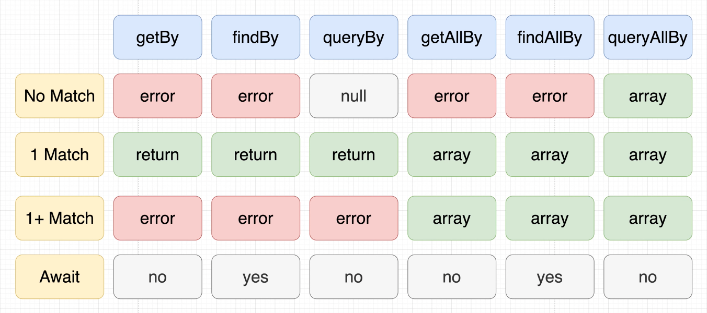
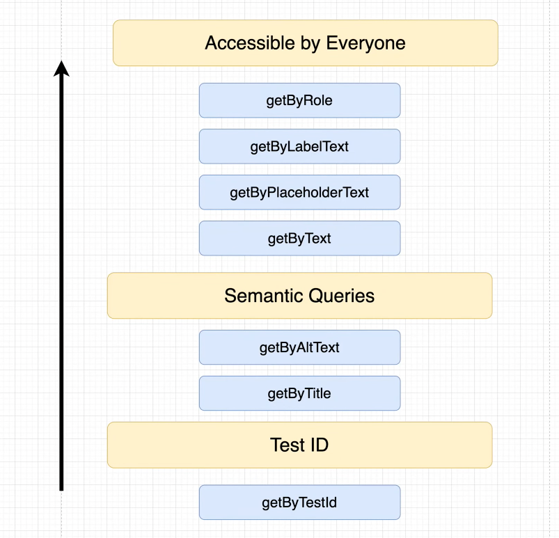

# React Testing Library Tutorial

## 📖 Chapters

1. Introduction
1. The Importance of Testing
   - Catch Bugs
   - Increases Confidence in Application
   - Speeds up QA Time
   - Can Serve as Documentations
1. Types of Test
   - Unit Tests
   - Integration Tests
   - End to End (E2E) Tests
1. Structure of Tests
   - Render a component we want to test
   - Find elements we want to interact with
   - Interact with those elements
   - Assert that the results are as expected
1. Intro to Query Methods
   

      
   

1. Priority
   

      
   

1. Using Query Methods
1. Assertions
1. Describe Block
1. Fire Events
1. Integration Tests
1. Finding Async Elements with FindBy
1. Mocking Requests
1. Before & After Each
